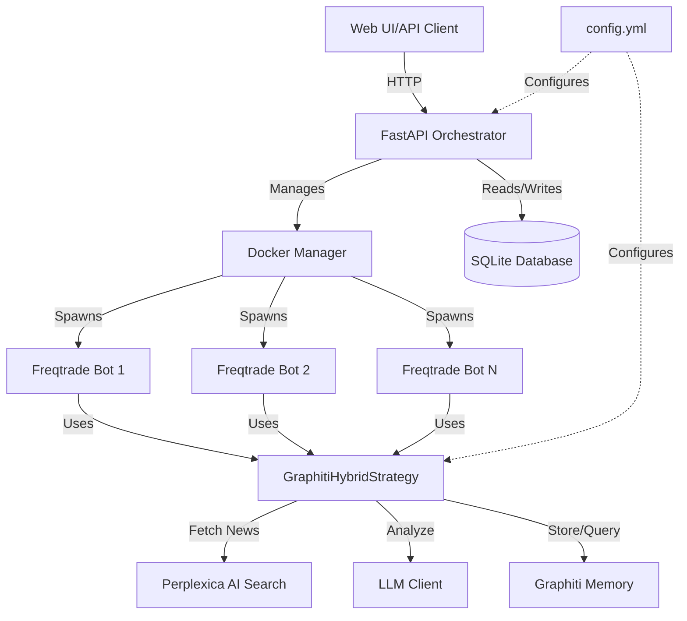

# AI-Trader with Orchestrator 🤖

**AI-powered crypto trading system** combining Freqtrade with AI-driven news analysis and shared graph memory.

[](https://github.com/freqtrade/freqtrade/actions/workflows/ci.yml)
[](https://coveralls.io/github/freqtrade/freqtrade?branch=develop)

---

## 🎯 What is AI-Trader Orchestrator?

A management layer for Freqtrade that enables:

- **Multi-bot deployment** - Run multiple trading bots simultaneously
- **AI-powered decisions** - News sentiment analysis before trade execution
- **Shared memory** - Bots learn from each other via graph database (Graphiti)
- **REST API** - Full lifecycle management (create, start, stop, delete bots)

### Architecture Overview



---

## 🚀 Quick Start (AI-Trader Orchestrator)

### Prerequisites

- Docker & Docker Compose
- Python 3.11+
- Access to external services:
  - **Graphiti** (graph memory service)
  - **Perplexica** (AI news search)
  - **LLM API** (OpenRouter, Ollama, or OpenAI)

### Installation

#### 1. Clone Repository

```bash
git clone https://github.com/GoGoButters/AI-Trader.git
cd AI-Trader
```

#### 2. Configure Services

Edit [`config.yml`](config.yml) with your API keys and endpoints:

```yaml
services:
  graphiti: "url: http://YOUR_SERVER:8000; token: YOUR_TOKEN"
  perplexica: "url: http://YOUR_SERVER:3001; api_key: YOUR_KEY"

models:
  primary_analysis: "model: MODEL_NAME; api_base: http://YOUR_SERVER:11434; api_key: YOUR_KEY"
  deep_reasoning: "model: MODEL_NAME; api_base: http://YOUR_SERVER:11434; api_key: YOUR_KEY"
  fallback: "model: FALLBACK_MODEL; api_base: http://YOUR_SERVER:11434; api_key: YOUR_KEY"
```

#### 3. Copy Strategy

```bash
# Windows
copy orchestrator\GraphitiHybridStrategy_template.py user_data\strategies\GraphitiHybridStrategy.py

# Linux/Mac
cp orchestrator/GraphitiHybridStrategy_template.py user_data/strategies/GraphitiHybridStrategy.py
```

#### 4. Install Dependencies

```bash
cd orchestrator/backend
pip install -r requirements.txt
```

#### 5. Run Orchestrator

**Development mode:**

```bash
cd orchestrator/backend
python main.py
```

**Docker mode:**

```bash
cd orchestrator
docker-compose up -d
```

API available at: **<http://localhost:8080/docs>**

---

## 📡 API Usage Examples

### Create a Bot

```bash
curl -X POST "http://localhost:8080/api/bots/create" \
  -H "Content-Type: application/json" \
  -d '{
    "name": "btc-demo-1",
    "pair": "BTC/USDT",
    "timeframe": "15m",
    "mode": "demo",
    "params": {
      "rsi_period": 14,
      "rsi_oversold": 30,
      "rsi_overbought": 70,
      "stop_loss": -0.05,
      "take_profit": 0.10,
      "enable_ai_analysis": true,
      "news_check_interval": 3600,
      "min_impact_score": 0.3
    }
  }'
```

### List All Bots

```bash
curl "http://localhost:8080/api/bots/list"
```

### Stop a Bot

```bash
curl -X POST "http://localhost:8080/api/bots/1/stop"
```

### Delete a Bot

```bash
curl -X DELETE "http://localhost:8080/api/bots/1"
```

---

## 🧠 How GraphitiHybridStrategy Works

1. **Technical Trigger** - Monitors RSI indicators
2. **News Fetching** - Queries Perplexica for crypto news (configurable interval)
3. **AI Correlation Analysis** - LLM analyzes correlation between:
   - News sentiment
   - RSI value
   - Price movement
4. **Impact Score Calculation** - AI computes influence score (0.0-1.0)
5. **Shared Memory** - Results stored in Graphiti for all bots
6. **Trade Confirmation** - Entry only if:
   - `impact_score >= min_impact_score`
   - `sentiment == "positive"`
   - Historical data supports decision

---

## 📁 Project Structure

```
AI-Trader/
├── config.yml                          # Central configuration
├── orchestrator/
│   ├── backend/                        # FastAPI orchestrator
│   │   ├── main.py                     # Entry point
│   │   ├── config_parser.py            # Config parser
│   │   ├── models.py                   # Database models
│   │   ├── docker_manager.py           # Docker lifecycle
│   │   ├── graphiti_client.py          # Graph memory client
│   │   ├── perplexica_client.py        # News search client
│   │   ├── llm_client.py               # LLM client
│   │   └── api/
│   │       └── bots.py                 # Bot management API
│   ├── ui/                             # Frontend (TODO)
│   └── GraphitiHybridStrategy_template.py
└── user_data/
    └── strategies/                     # Freqtrade strategies
        └── GraphitiHybridStrategy.py
```

---

## ⚙️ Configuration Reference

### Services

- **graphiti** - Graph memory database for cross-bot learning
- **perplexica** - AI-powered news search service

### Models

- **primary_analysis** - Fast model for quick analysis
- **deep_reasoning** - Advanced model for complex decisions
- **embeddings** - Model for vector embeddings
- **fallback** - Backup model when primary fails

### Database

- Default: SQLite (`orchestrator/data/orchestrator.db`)
- Optional: PostgreSQL (configure in `config.yml`)

---

## ⚠️ Important Notes

> **Demo Mode First**: Always test strategies in demo mode before using real funds.

> **API Keys Security**: Never commit real API keys to version control.

> **Service Dependencies**: Ensure Graphiti and Perplexica are running before starting bots.

> **Risk Warning**: Cryptocurrency trading carries high risk. Use at your own risk.

---

## 📚 Documentation

- [Orchestrator README](orchestrator/README.md) - Detailed setup guide
- [Walkthrough](https://github.com/GoGoButters/AI-Trader/blob/main/docs/walkthrough.md) - Implementation details
- [Freqtrade Documentation](https://www.freqtrade.io) - Core trading bot docs

---

## 🛠️ Development

### Running Tests

```bash
# Backend tests (TODO)
cd orchestrator/backend
pytest

# Config parser test
python -c "from config_parser import load_config; load_config('../../config.yml')"
```

### Adding New AI Services

1. Add configuration to `config.yml`
2. Create async client (see `graphiti_client.py` example)
3. Integrate into strategy or API

---

# Original Freqtrade Documentation

---

## Disclaimer

This software is for educational purposes only. Do not risk money which
you are afraid to lose. USE THE SOFTWARE AT YOUR OWN RISK. THE AUTHORS
AND ALL AFFILIATES ASSUME NO RESPONSIBILITY FOR YOUR TRADING RESULTS.

Always start by running a trading bot in Dry-Run and do not engage money
before you understand how it works and what profit/loss you should
expect.

We strongly recommend you to have coding and Python knowledge. Do not
hesitate to read the source code and understand the mechanism of this bot.

## Supported Exchange marketplaces

Please read the [exchange-specific notes](docs/exchanges.md) to learn about special configurations that maybe needed for each exchange.

- [X] [Binance](https://www.binance.com/)
- [X] [BingX](https://bingx.com/invite/0EM9RX)
- [X] [Bitget](https://www.bitget.com/)
- [X] [Bitmart](https://bitmart.com/)
- [X] [Bybit](https://bybit.com/)
- [X] [Gate.io](https://www.gate.io/ref/6266643)
- [X] [HTX](https://www.htx.com/)
- [X] [Hyperliquid](https://hyperliquid.xyz/) (A decentralized exchange, or DEX)
- [X] [Kraken](https://kraken.com/)
- [X] [OKX](https://okx.com/)
- [X] [MyOKX](https://okx.com/) (OKX EEA)
- [ ] [potentially many others](https://github.com/ccxt/ccxt/). _(We cannot guarantee they will work)_

### Supported Futures Exchanges (experimental)

- [X] [Binance](https://www.binance.com/)
- [X] [Bitget](https://www.bitget.com/)
- [X] [Gate.io](https://www.gate.io/ref/6266643)
- [X] [Hyperliquid](https://hyperliquid.xyz/) (A decentralized exchange, or DEX)
- [X] [OKX](https://okx.com/)
- [X] [Bybit](https://bybit.com/)

Please make sure to read the [exchange specific notes](docs/exchanges.md), as well as the [trading with leverage](docs/leverage.md) documentation before diving in.

### Community tested

Exchanges confirmed working by the community:

- [X] [Bitvavo](https://bitvavo.com/)
- [X] [Kucoin](https://www.kucoin.com/)

## Freqtrade Features

- [x] **Based on Python 3.11+**: For botting on any operating system - Windows, macOS and Linux.
- [x] **Persistence**: Persistence is achieved through sqlite.
- [x] **Dry-run**: Run the bot without paying money.
- [x] **Backtesting**: Run a simulation of your buy/sell strategy.
- [x] **Strategy Optimization by machine learning**: Use machine learning to optimize your buy/sell strategy parameters with real exchange data.
- [X] **Adaptive prediction modeling**: Build a smart strategy with FreqAI that self-trains to the market via adaptive machine learning methods. [Learn more](https://www.freqtrade.io/en/stable/freqai/)
- [x] **Whitelist crypto-currencies**: Select which crypto-currency you want to trade or use dynamic whitelists.
- [x] **Blacklist crypto-currencies**: Select which crypto-currency you want to avoid.
- [x] **Builtin WebUI**: Builtin web UI to manage your bot.
- [x] **Manageable via Telegram**: Manage the bot with Telegram.
- [x] **Display profit/loss in fiat**: Display your profit/loss in fiat currency.
- [x] **Performance status report**: Provide a performance status of your current trades.

## Freqtrade Quick start

Please refer to the [Docker Quickstart documentation](https://www.freqtrade.io/en/stable/docker_quickstart/) on how to get started quickly.

For further (native) installation methods, please refer to the [Installation documentation page](https://www.freqtrade.io/en/stable/installation/).

## Requirements

### Software requirements

- [Python >= 3.11](http://docs.python-guide.org/en/latest/starting/installation/)
- [pip](https://pip.pypa.io/en/stable/installing/)
- [git](https://git-scm.com/book/en/v2/Getting-Started-Installing-Git)
- [TA-Lib](https://ta-lib.github.io/ta-lib-python/)
- [virtualenv](https://virtualenv.pypa.io/en/stable/installation.html) (Recommended)
- [Docker](https://www.docker.com/products/docker) (Recommended)

---

## Support & Contributing

For detailed Freqtrade documentation, support, and contribution guidelines, visit:

- **Documentation**: [freqtrade.io](https://www.freqtrade.io)
- **Discord**: [Join Server](https://discord.gg/p7nuUNVfP7)
- **Issues**: [GitHub Issues](https://github.com/freqtrade/freqtrade/issues)

**AI-Trader Orchestrator** is a fork maintained by [@GoGoButters](https://github.com/GoGoButters).

Original Freqtrade: [github.com/freqtrade/freqtrade](https://github.com/freqtrade/freqtrade)
